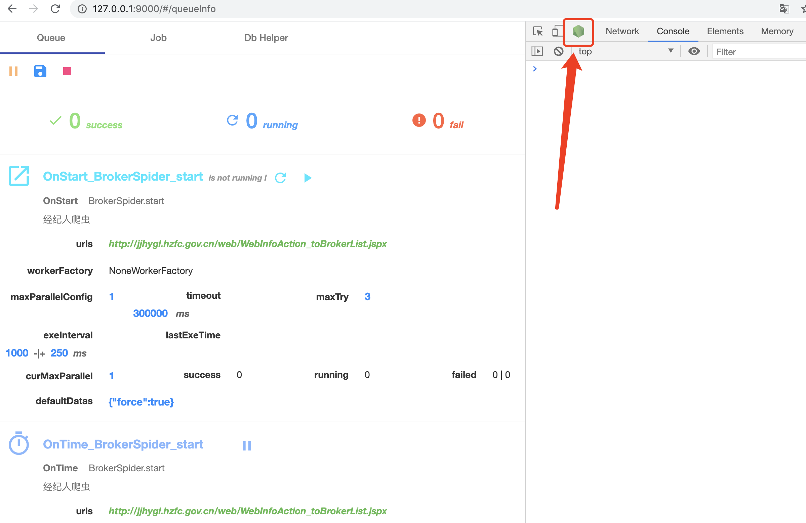
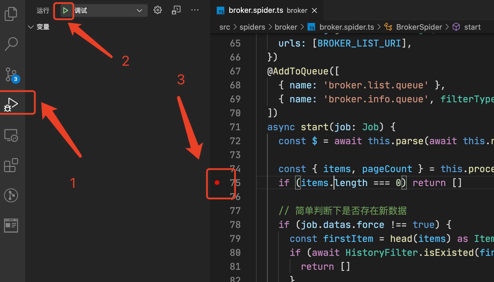
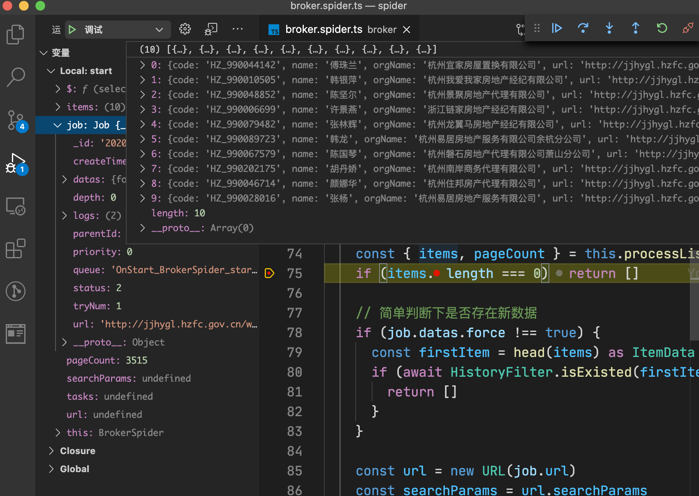

# 杭州二手房交易监管服务平台 - 数据采集系统

> 持续更新中～

[](https://www.typescriptlang.org/)
[](https://github.com/prettier/prettier)
[][ppspider]

基于 [ppspider][ppspider] 框架开发的 Web 爬虫程序，每天定时进行数据抓取和更新。

本项目初衷仅仅是因为练习技术，因缘际会下发现的 [杭州二手房交易监管服务平台][reiva]。

在平台上可以查看中介信息，同时如果你有被中介骚扰的情况，可以进入举报或投诉。

## 数据采集

暂完成 [机构人员信息](http://jjhygl.hzfc.gov.cn/web/WebInfoAction_toCompanyList.jspx) 的采集，其他功能待实现。

定时采集采用增量模式，如果列表的第一条数据已经存在就停止采集；手动启动的方式除外，但采集过依然不会继续采集，后续支持通过 api 请求的方式，强制更新。

| 模块         | 子模块               | 采集周期 | 采集时间   | 是否开放数据 |
| ------------ | -------------------- | :------: | ---------- | :----------: |
| 机构人员信息 | 从业机构档案         |   每日   | 凌晨 01:00 |              |
|              | 从业人员档案         |   每日   | 凌晨 01:00 |              |
| 服务评价     | 机构交易评价         |    -     | -          |              |
|              | 人员交易评价         |    -     | -          |              |
| 企业监管信息 | 机构监管             |    -     | -          |              |
|              | 严重非法企业名录     |    -     | -          |              |
|              | 企业经营异常名录     |    -     | -          |              |
| 行业信用信息 | 行业红名单           |    -     | -          |              |
|              | 行业惩戒名单         |    -     | -          |              |
|              | 行业灰名单           |    -     | -          |  非公开数据  |
|              | 行业风险警示名单     |    -     | -          |              |
|              | 行业红名单           |    -     | -          |              |
| 服务评价     | 机构星级             |    -     | -          |              |
|              | 人员星级             |    -     | -          |              |
| 行业管理     | 机构检查             |    -     | -          |              |
|              | 人员检查             |    -     | -          |              |
|              | 行业公告             |    -     | -          |              |
|              | 政策法规             |    -     | -          |              |
| 排行榜       | 机构签约排行         |    -     | -          |              |
|              | 人员签约排行         |    -     | -          |              |
|              | 机构评价(满意度)排行 |    -     | -          |              |
|              | 人员评价(满意度)排行 |    -     | -          |              |

## 数据清洗

数据采用 [class-validator][class-validator] 模块进行数据转换和过滤。

清理后的数据通过人工二次校验后，再导入生产数据库。

## 启动项目

[ppspider][ppspider] 不要求一定使用 mongodb 作为存储端, 但本项目必须使用 **mongodb** 数据库。

可以在项目根目录新建 `.env` 文件，内容参考 `.env.example`。

也可以在系统环境变量中，通过 `MONGODB_URI` 指定 **mongodb** 数据库的地址。

## 开发步骤

你需要安装 [Node.js][nodejs] 的版本为 12+.

克隆此仓库后运行:

```bash
# 安装依赖
$ yarn install

# 启动示例
$ yarn dev

# 编译代码
$ yarn build
```

启动后，打开浏览器:

```bash
# 打开浏览器
$ open http://localhost:9000/
```

## 如何调试

执行以下命令后，可以使用任何支持 `node inspector` 协议的工具上调试

```bash
# 启动调试模式
$ npm run debug
```

**在 Chrome devtools 上**



为防止流量太大，请手动打开视频: [查看视频](./screenshots/chrome-devtools-debug.mp4)

**在 VSCode 上**




## 待办事件

- [ ] 当 mongodb 无法使用时，降级为 [nedb][nedb]
- [ ] 添加代理池
- [ ] 添加 docker 支持

## 免责声明

本项目仅供学习交流，如作他用所承受的法律责任一概与作者无关。

下载使用，即代表你同意上述观点。

## License

- MIT

[nodejs]: https://nodejs.org/
[ppspider]: https://github.com/xiyuan-fengyu/ppspider
[nedb]: https://github.com/louischatriot/nedb
[class-validator]: https://github.com/typestack/class-validator
[reiva]: http://jjhygl.hzfc.gov.cn/
